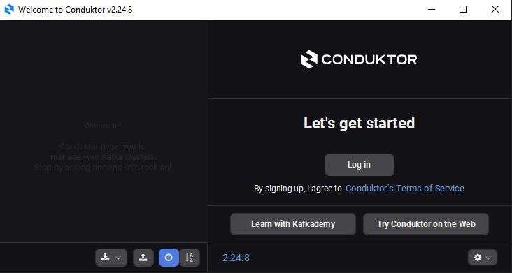
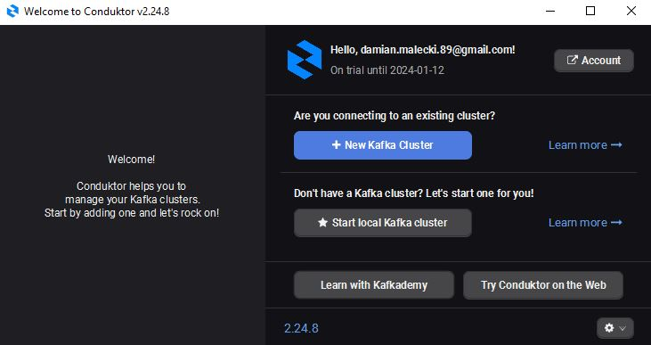
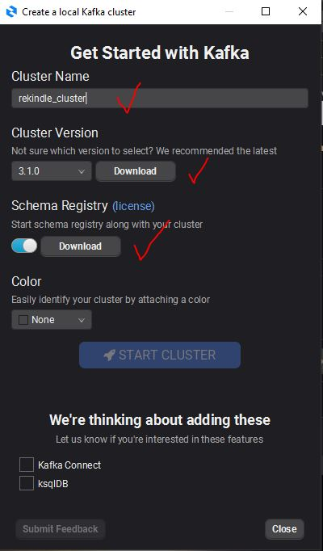
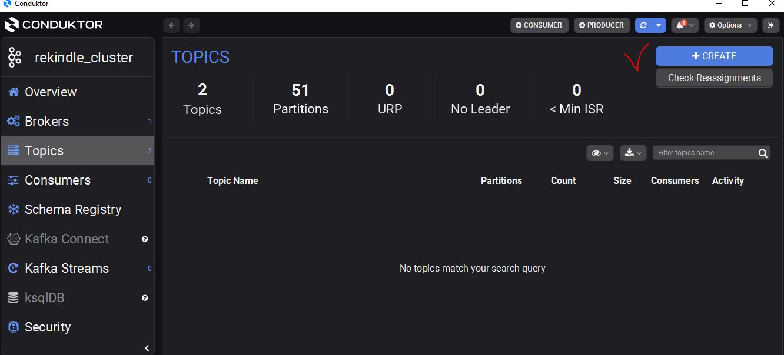
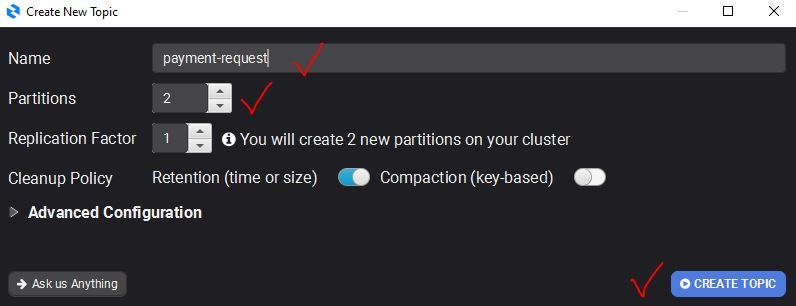
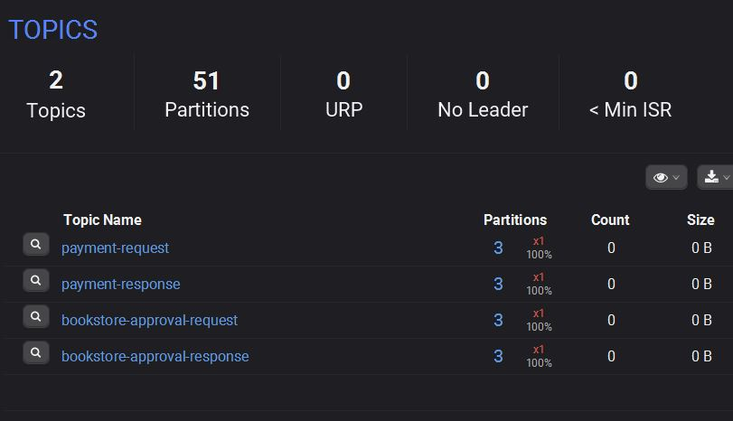

# <p align="center"> <span style="color:red;"> REKINDLE BOOK STORE

## <p align="center"> <span style="color:red;">Straight from the eighties with a synthwave vibe

<p align="center">
  <br /><br />
</p>

> <p align="center"> <span style="color:orange;"> Welcome to the store which will reignite the flame of affection to your old school books and
> beyond...

## <span style="color:green;"> Built With

* [Java 21](https://github.com/corretto/corretto-21/releases)
* [Gradle 8.5](https://gradle.org/install/)
* [Spring Framework](https://spring.io/)
* [Kafka](https://kafka.apache.org/downloads)
* [PostgreSQL](https://www.postgresql.org/download/)

# <span style="color:yellow;"> Getting Started

<span style="color:lime;">You need to have **_Java 21_** installed and configured in your PATH
variable

* <span style="color:lime;">This project was build and tested on amazon **_coretto 21.0.1_**

* <span style="color:lime;">The project uses Gradle is its build tool and comes with Gradle wrapper
* <span style="color:lime;">but for those who wish to install gradle locally - the version is *
  *_8.5_**

## <span style="color:magenta;"> For Docker Users

### <span style="color:magenta;"> 1. Source Code build and docker images setup
* <span style="color:cyan;">In the root project directory execute the following commands using
either gradle or ./gradlew
* <span style="color:cyan;">These will build source code and prepare docker images


><li>gradle clean build</li>
><li>gradle jibDockerBuild</li>

### <span style="color:magenta;"> 2. Infrastructure and ecosystem setup

#### <span style="color:magenta;"> Kafka

* <span style="color:cyan;">Go to docker-compose/rekindle-local directory
* <span style="color:cyan;">and execute the following commands

><li>cd docker-compose/rekindle-local</li>
><li>docker-compose -f init_kafka_cluster.yml up -d</li>

* <span style="color:cyan;">wait till all services have started

><li>docker-compose -f init_kafka_topics.yml up</li>

* <span style="color:cyan;">this will add necessary kafka topics to the boostrap servers. Can be
  deleted afterwards

#### <span style="color:magenta;"> Database & data migration
><li>docker-compose -f init_rekindle_database.yml up -d --wait</li>
* <span style="color:cyan;">this will start PostgreSQL database
* <span style="color:cyan;">then from root project directory execute

><li>gradle flywayMigrate or ./gradlew flywayMigrate -p infrastructure/database-migrations/</li>

#### <span style="color:magenta;"> Microservices
* <span style="color:cyan;">Go to docker-compose/rekindle-local directory

><li>docker-compose -f init_rekindle_app.yml up -d</li>

* <span style="color:cyan;">this will start all microservices in sequence where some require kafka
  and the database

* <span style="color:cyan;">later you can just use 

><li>docker-compose -f init_kafka_cluster.yml stop</li>
><li>docker-compose -f init_kafka_cluster.yml start</li>
><li>docker-compose -f init_rekindle_app.yml stop</li>
><li>docker-compose -f init_rekindle_app.yml start</li>

### <span style="color:magenta;"> THAT'S IT. You're good to go :)

# <span style="color:coral;"> For WINDOWS Manual Installation

### <span style="color:coral;">1. Source Code Build
* <span style="color:cyan;">In the root project directory execute the following command using
  either gradle or ./gradlew

><li>gradle clean build</li>

### <span style="color:coral;">2. Database

* Download and install [PostgreSQL version 16.1](https://sbp.enterprisedb.com/getfile.jsp?fileid=1258792)
* Create database called **_postgres_** with username **_postgres_** and password **_admin_**
* listening on port **_5432_**
* Then from **_root project directory_** run the following command

> <li>gradle flywayMigrate -p infrastructure/database-migrations/</li>

### <span style="color:coral;">3. Kafka
* Download and install [conduktor](https://releases.conduktor.io/win-msi) application
* Create free account and log in

<p align="center">
  
</p>

* Click on "Start local Kafka cluster"
<p align="center">
  
</p>

* Name the cluster however you want. Download cluster version 3.1.0 then check and download Schema Registry
* Finally, start the cluster
<p align="center">
  
</p>

* Go to tab "Topics" and click "Create"
<p align="center">
  
</p>

* Create 4 topics each with 3 partitions and 1 replication factor
```
payment-request
payment-response
bookstore-approval-request
bookstore-approval-response
```
<p align="center">
  
</p>

<p align="center">
  
</p>

### <span style="color:coral;">4. Services start up & termination
* From root project directory execute:
```
via CMD
services-start.bat

via git bash or other terminal
./services-start.sh
```
* Should you want to terminate all services, execute:
```
via CMD
services-stop.bat

via git bash or other terminal
./services-stop.sh
```
### <span style="color:coral;"> THAT'S IT. You're good to go :)

## <span style="color:gold;"> Documentation

### <span style="color:violet;"> Microservices

* <span style="color:orange;">Rekindle BookStore consists of several central services:

> customer-service - handles customer creation
>
> bookstore-service - handles bookstores in the rekindle network and their inventory
>
> order-service - orchestrates customer's purchases in rekindle network
>
> payment-service - handles customer's payments and wallet top-ups

### <span style="color:violet;"> Infrastructure

* <span style="color:orange;">Rekindle Bookstore network is handled internally by:

> config-server [handles microservices configuration locally]
>
> authorization-server [for OAuth2 authorization]
>
> eureka-discovery-server [for internal microservice discovery]
>
> gateway-server [for inbound traffic and load balancing]

### <span style="color:violet;"> Infrastructure - events

* <span style="color:orange;">Orders made in rekindle network are handled seamlessly via events
  orchestrated by Apache Kafka

> zookeeper
>
> 3 kafka brokers
>
> schema registry (with avro schema)
>
> kafka manager [available at http://localhost:9000]
>
> [kafka manager requires manual cluster configuration
> 1. go to cluster dropdown and add new cluster
> 2. Specify its name
> 3. In cluster host type zookeeper:2181
> 4. Now you can see available topics and brokers
     > ]

### <span style="color:violet;"> Infrastructure - database

* <span style="color:orange;">At the moment there is one central database but more will be
  introduced for each microservice
* <span style="color:orange;">To connect to the PostgreSQL Database please install the latest
  version

><li>connection url: jdbc:postgresql://localhost:5432/postgres</li>
><li>username: postgres</li>
><li>password: admin</li>
><li>schemas: bookstore,customer,order,payment</li>

### <span style="color:violet;"> Endpoints are documented using OpenApi

* http://localhost:8181/swagger-ui/index.html [order-microservice]
* http://localhost:8182/swagger-ui/index.html [payment-microservice]
* http://localhost:8183/swagger-ui/index.html [bookstore-microservice]
* http://localhost:8184/swagger-ui/index.html [customer-microservice]
* http://localhost:8761/ [netflix-eureka service discovery]

### <span style="color:violet;"> Gateway Server

* <span style="color:orange;">core url address of rekindle book store is http://localhost:8024
* <span style="color:orange;">the server is secured with JWT Oauth2 protocol
* <span style="color:orange;">available services in the network are:

><li>http://localhost:8024/rekindle/orders</li>
><li>http://localhost:8024/rekindle/payments</li>
><li>http://localhost:8024/rekindle/bookstores</li>
><li>http://localhost:8024/rekindle/customers</li>

### <span style="color:violet;"> Oauth 2.0 authorization

* <span style="color:orange;">Rekindle Network uses Oauth2 JTW authorization

><li>http://localhost:8023/oauth2/token [authorization server]</li>
><li>client id: internal-ms</li>
><li>client secret: Nr4lsn5o</li>
><li>scopes: communicate.read communicate.write</li>
><li>rant type: client credentials</li>
><li>header prefix: Bearer</li>

### <span style="color:violet;"> Volume Mapping

* <span style="color:orange;">Kafka, zookeeper and postgres are mapped to folders inside the project
  for simplicity

><li>./docker-compose/rekindle-local/docker-compose/volumes/kafka/*</li>
><li>./docker-compose/rekindle-local/volumes/zookeeper/data/*</li>
><li>./docker-compose/rekindle-local/volumes/zookeeper/transactions/*</li>
><li>./docker-compose/rekindle-local/volumes/postgre/*</li>

* <span style="color:orange;">In case of docker container removals, contents of these folders also
  have to be deleted
* <span style="color:orange;">manually before creating the build anew

# <span style="color:cyan;">STILL UNDER CONSTRUCTION

### User Interface

* User interface will be created as a Single Page Application with React, NodeJs and Typescript

## License

Apache 2.0 © 